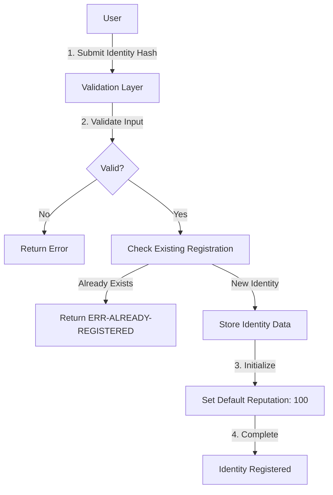
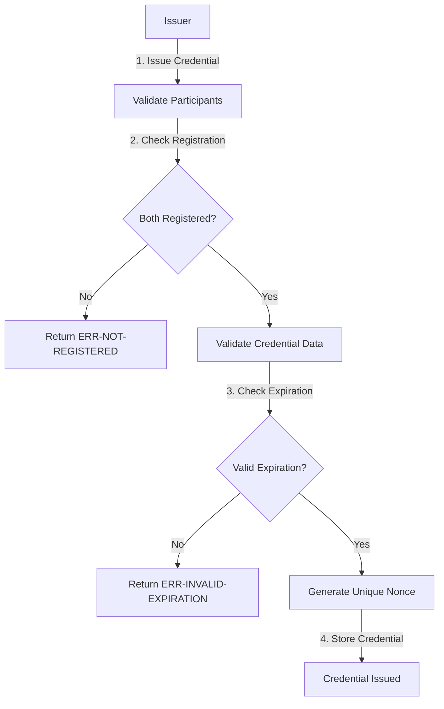
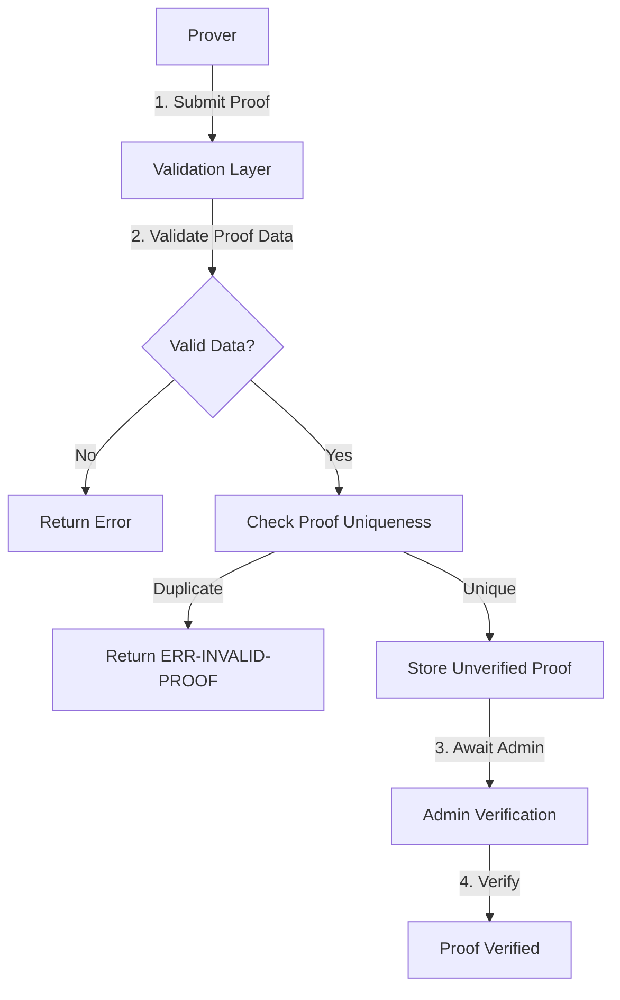
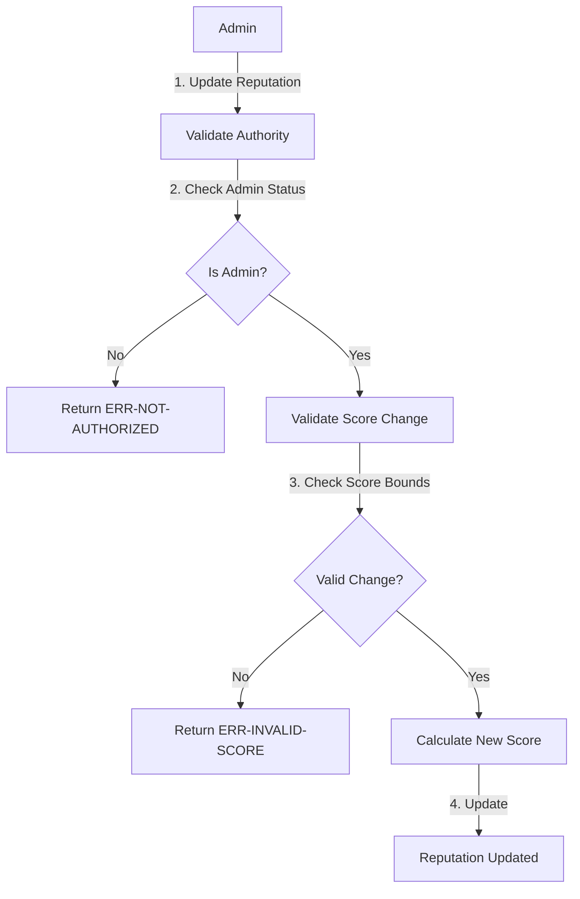

# VeraCrypt Identity Protocol

[](https://github.com/veracrypt/identity-protocol)
[](LICENSE)
[](https://stacks.co)
[](https://clarity-lang.org)

A next-generation blockchain-based identity verification system that combines cryptographic proofs with reputation-based trust mechanisms. VeraCrypt enables secure, privacy-preserving identity management through zero-knowledge proofs while maintaining decentralized credential issuance and verification.

## 🚀 Key Features

- **Zero-Knowledge Proof Integration** - Privacy-preserving authentication without revealing sensitive data
- **Dynamic Reputation System** - Trust-based scoring with administrative controls
- **Decentralized Credential Management** - Distributed credential issuance and verification
- **Robust Recovery Mechanisms** - Secure identity recovery for lost or compromised accounts
- **Comprehensive Validation Framework** - Multi-layer security with input sanitization

## 📋 Table of Contents

- [System Overview](#system-overview)
- [Contract Architecture](#contract-architecture)
- [Data Flow](#data-flow)
- [Installation](#installation)
- [Usage](#usage)
- [API Reference](#api-reference)
- [Security Considerations](#security-considerations)
- [Contributing](#contributing)
- [License](#license)

## 🏗️ System Overview

VeraCrypt Identity Protocol operates as a decentralized identity management system built on the Stacks blockchain. The protocol establishes a trustless environment where identities can be verified without compromising privacy, credentials can be issued and revoked by authorized entities, and reputation scores provide a dynamic trust mechanism.

### Core Components

1. **Identity Registry** - Stores cryptographic identity hashes with metadata
2. **Credential System** - Manages verifiable credentials with expiration and revocation
3. **Zero-Knowledge Proof Engine** - Handles privacy-preserving verification
4. **Reputation Engine** - Tracks and manages trust scores
5. **Recovery System** - Provides secure identity restoration mechanisms

## 🔧 Contract Architecture

The VeraCrypt protocol is implemented as a single Clarity smart contract with modular components:

```
VeraCrypt Identity Protocol
├── Administrative Layer
│   ├── Admin Management
│   └── System Configuration
├── Identity Management
│   ├── Registration & Authentication
│   ├── Identity Validation
│   └── Recovery Mechanisms
├── Credential System
│   ├── Issuance & Verification
│   ├── Revocation Management
│   └── Expiration Handling
├── Zero-Knowledge Proofs
│   ├── Proof Submission
│   ├── Verification Process
│   └── Cryptographic Validation
└── Reputation System
    ├── Score Calculation
    ├── Trust Metrics
    └── Administrative Controls
```

### Data Structures

#### Identity Map

```clarity
identities: principal -> {
    hash: (buff 32),
    credentials: (list 10 principal),
    reputation-score: uint,
    recovery-address: (optional principal),
    last-updated: uint,
    status: (string-ascii 20)
}
```

#### Credential Map

```clarity
credentials: {issuer: principal, nonce: uint} -> {
    subject: principal,
    claim-hash: (buff 32),
    expiration: uint,
    revoked: bool,
    metadata: (string-utf8 256)
}
```

#### Zero-Knowledge Proof Map

```clarity
zero-knowledge-proofs: (buff 32) -> {
    prover: principal,
    verified: bool,
    timestamp: uint,
    proof-data: (buff 1024)
}
```

## 🔄 Data Flow

### Identity Registration Flow



### Credential Issuance Flow



### Zero-Knowledge Proof Flow



### Reputation Update Flow



## 🛠️ Installation

### Prerequisites

- [Stacks CLI](https://docs.stacks.co/docs/cli)
- [Clarinet](https://github.com/hirosystems/clarinet)
- Node.js 16+

### Deploy Contract

```bash
# Clone repository
git clone https://github.com/veracrypt/identity-protocol.git
cd identity-protocol

# Deploy to testnet
clarinet deploy --testnet

# Deploy to mainnet
clarinet deploy --mainnet
```

## 📖 Usage

### Register Identity

```clarity
(contract-call? .veracrypt-identity register-identity 
    0x1234567890abcdef1234567890abcdef12345678 
    (some 'SP2J6ZY48GV1EZ5V2V5RB9MP66SW86PYKKNRV9EJ7))
```

### Issue Credential

```clarity
(contract-call? .veracrypt-identity issue-credential
    'SP2J6ZY48GV1EZ5V2V5RB9MP66SW86PYKKNRV9EJ7
    0xabcdef1234567890abcdef1234567890abcdef12
    (+ block-height u1000)
    u"Academic Degree Certificate")
```

### Submit Zero-Knowledge Proof

```clarity
(contract-call? .veracrypt-identity submit-proof
    0x9876543210fedcba9876543210fedcba98765432
    0x1a2b3c4d5e6f7890abcdef1234567890abcdef12...)
```

## 📚 API Reference

### Public Functions

#### Administrative Functions

- `set-admin(new-admin: principal)` - Transfer admin privileges

#### Identity Management

- `register-identity(identity-hash: buff 32, recovery-addr: optional principal)` - Register new identity
- `initiate-recovery(identity: principal, new-hash: buff 32)` - Recover compromised identity

#### Credential System

- `issue-credential(subject: principal, claim-hash: buff 32, expiration: uint, metadata: string-utf8 256)` - Issue new credential
- `revoke-credential(issuer: principal, nonce: uint)` - Revoke existing credential

#### Zero-Knowledge Proofs

- `submit-proof(proof-hash: buff 32, proof-data: buff 1024)` - Submit proof for verification
- `verify-proof(proof-hash: buff 32)` - Admin verification of submitted proof

#### Reputation System

- `update-reputation(subject: principal, score-change: int)` - Update reputation score

### Read-Only Functions

- `get-identity(identity: principal)` - Retrieve identity information
- `get-credential(issuer: principal, nonce: uint)` - Retrieve credential details
- `verify-credential(issuer: principal, nonce: uint)` - Check credential validity
- `get-proof(proof-hash: buff 32)` - Retrieve proof information

## 🔒 Security Considerations

### Input Validation

- All inputs undergo comprehensive validation before processing
- Hash values must be non-zero and properly formatted
- Expiration times must be future-dated with minimum block requirements
- Metadata length is strictly controlled to prevent overflow attacks

### Access Control

- Administrative functions require proper authorization
- Recovery mechanisms verify designated recovery addresses
- Credential operations validate issuer authority

### Cryptographic Security

- Zero-knowledge proofs require minimum data size validation
- Proof hash collision prevention through uniqueness checks
- Reputation score bounds prevent integer overflow/underflow

## 🤝 Contributing

We welcome contributions to the VeraCrypt Identity Protocol! Please read our [Contributing Guidelines](CONTRIBUTING.md) and [Code of Conduct](CODE_OF_CONDUCT.md).

### Development Setup

```bash
# Install dependencies
npm install

# Run tests
clarinet test

# Check contract syntax
clarinet check
```

## 📄 License

This project is licensed under the MIT License - see the [LICENSE](LICENSE) file for details.
